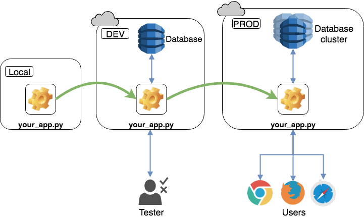

# CI/CD Pipeline

## Core concepts

### Single Source Repository

Git branching

### Automating the Build

### Automated Testing

* Cover every new function with a unit test

### Use an External Continuous Integration Service

### Testing in a Stagin Environment

The development environment should replicate production conditions as closely as possible. This setup is often called *DEV/PROD parity*. Keep the environment on your local computer as similar as possible to the DEV and PROD environments to minimize anomalies when deploying applications.

